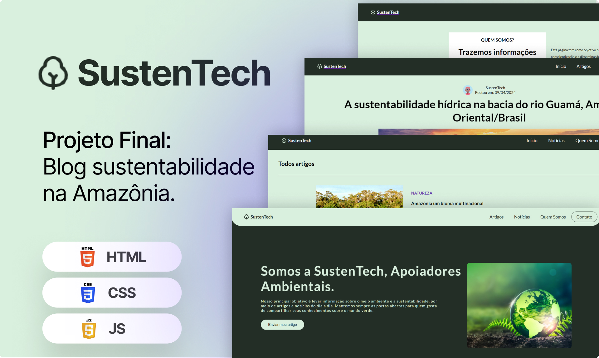

<h1 align="center">PROJETO FINAL - Modulo 02#</h1>

Projeto final desenvolvido para o módulo 02, do curso Programadores do Amanhã.  

  

 

  

<h2 id="tecnologias"></h2>

## 🚀 Tecnologias 

Este projeto foi desenvolvido com:

- HTML, CSS e JavaScript
- JavaScript específico
- Git e GitHub

<h2 id="informações"></h2>

## 📌 Informações

- Este projeto visa desenvolver uma plataforma de blog front-end dedicada à conscientização sobre a sustentabilidade na Amazônia. Os usuários podem acessar artigos sobre questões ambientais, promovendo discussões e ações positivas para a preservação da região.

<h2 id="projeto"></h2>

## 💻 Projeto

Projeto Final dos Programadores do Amanhã - Modulo 02#. Utiliza HTML, CSS e JavaScript com Type Module para simular um banco de dados local, oferecendo operações eficientes de manipulação do DOM e URL.

Mapa do site:
Página inicial > Artigos > Artigo individual > Quem Somos

- [Visite o projeto online](https://jamyle-elen.github.io/Projeto_final-M2/)

## Autores

<table>
  <tbody>
    <tr>
      <td align="center" valign="top" width="14.28%"><a href="https://www.linkedin.com/in/amadeu-f-684340231"> <b>Amadeu Fernandes</b></a> <a href="https://github.com/Amadeudev" title="Code">💻</a> </td> 
      <td align="center" valign="top" width="14.28%"><a href="https://www.linkedin.com/in/alexsandro-filho-189089264"> <b>Alexsandro Palmeira</b></a> <a href="https://github.com/Alexpsf" title="Code">💻</a> </td>
      <td align="center" valign="top" width="14.28%"><a href="https://www.linkedin.com/in/jamyle-elen/"> <b>Jamyle Elen</b></a> <a href="https://github.com/Jamyle-Elen" title="Code">💻</a> </td>
      <td align="center" valign="top" width="14.28%"><a href="https://www.linkedin.com/in/sabrina-marques-268b292b5"> <b>Sabrina Marques</b></a> <a href="https://github.com/Sabrina-Marks" title="Code">💻</a> </td>
      <td align="center" valign="top" width="14.28%"><a href="https://www.linkedin.com/in/reurylima/"> <b>Reury Cardoso</b></a> <a href="https://github.com/reury-cardoso" title="Code">💻</a> </td>
    </tr>
  </tbody>
</table>

## :memo: Licença

Este projeto é licenciado sob a Licença [MIT]